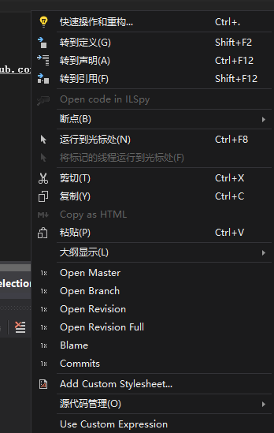
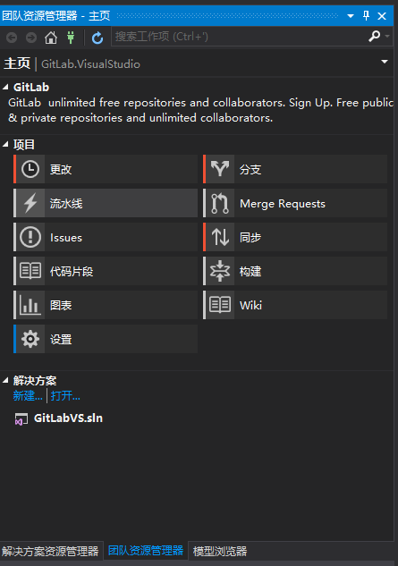
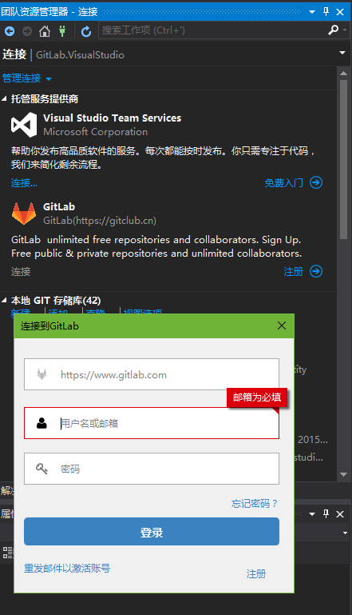

# GitLab  Extension for Visual Studio

You can log any of your favorite GitLab servers and start your great job!

The GitLab Extension for Visual Studio provides GitLab integration in Visual Studio 2015/2017.
Most of the extension UI lives in the Team Explorer pane, which is available from the View menu.

Appveyor:

The Visual Studio Extension is also available at the [Visual Studio Marketplace](https://marketplace.visualstudio.com/items?itemName=MysticBoy.GitLabExtensionforVisualStudio), or by searching for RESX in the Visual Studio extension manager.
The latest build of the Visual Studio Extension is available at the [Open VsixGallery](http://vsixgallery.com/extension/54803a44-49e0-4935-bba4-7d7d91682273/)

## What's new ?
**V1.0.160**

* Automatically detects the API version of Gitlab

**V1.0.154**

* Visual Studio 2019 support

**V1.0.150** 

   - AddOpen URL from clipboard
   - Support Gitee.com 
   - fix #35

**V1.0.0.122**

Fix HttpUtility.UrlEncode processing username or email causing problems that cannot be logged in

**V1.0.0.119**

Now update login mode is OAuth2, which can't be logon before because the new version of GitLab's API session has been discarded.

The two API login methods are supported in the login interface, and the old version of GitLab needs to be selected manually. The default is that the login mode is OAuth2 and V4 !

**V1.0.0.115**

1.You can select GitLab Api version .

**V1.0.0.112**

1.modify "Open On GitLab" to "GitLab"

**V1.0.0.95**

1. French, Japanese, German and other languages have been added, but these are Google's translations, so we need human translation!
2. Open on GitLab move to  submenu!
3. Fixed issue #3,Thanks luky92!
4. The selected code can create code snippets directly
5. When you create a project, you can select namespases.
6. GitLab's Api is updated from V3 to V4.

**V1.0.0.70**

1. GitLab login information associated with the solution, easy to switch GitLab server.
2. Enter the password and press enter to login GitLab server.
3. Now, We can login   with two  factor authentication.just enter the personal access token into the password field.

**V1.0.0.58** 

1. Support for Visual Studio 2017 
2. Fix bus.

**V1.0.0.40** 
 1. Right click on editor, if repository is hosted on GitLab Server , you can jump to master/current branch/current revision's blob page and blame/commits page. If selecting line(single, range) in editor, jump with line number fragment.
 2. Fix [#4](https://www.gitlab.com/maikebing/GitLab.VisualStudio/issues/4) [#5](https://www.gitlab.com/maikebing/GitLab.VisualStudio/issues/5) [#6](https://www.gitlab.com/maikebing/GitLab.VisualStudio/issues/6)
Official builds of this extension are available at [the official website](http://visualstudio.gitclub.cn).

**HomePage**
 http://visualstudio.gitclub.cn/

### BUG And Issues

https://github.com/maikebing/GitLab.VisualStudio/issues

###    Visual Studio    |   Marketplace
https://marketplace.visualstudio.com/items?itemName=MysticBoy.GitLabExtensionforVisualStudio

### Thanks

####  GitHub Extension for Visual Studio

####  CodeCloud Extension for  Visual Studio

https://gitee.com/GitGroup/CodeCloud.VisualStudio

#### Visual Studio Extension for opening files on GitHub.com
https://github.com/neuecc/Open-on-GitHub 

#### NGitLab
https://github.com/Xarlot/NGitLab
https://github.com/Franklin89/NGitLab
https://github.com/maikebing/NGitLab

### Open On GitLab

###  Team Home Page

### Team Connct Page

